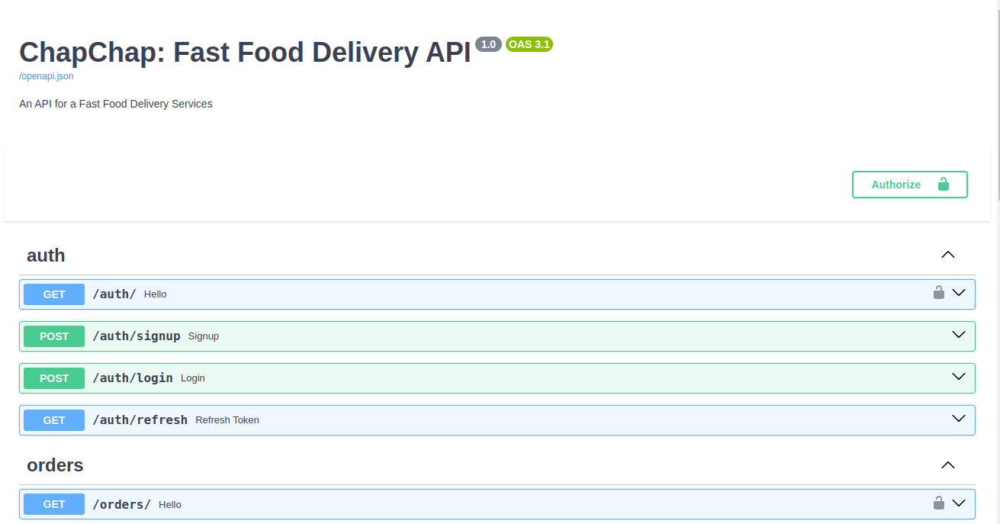

# ChapChap Fastfood API

This project is a FastAPI-based API with SQLAlchemy as the ORM and PostgreSQL as the database. It allows users to manage orders, meals, and a shopping cart.

## Prerequisites

Before running the API, ensure you have the following installed:

```
Python 3.7 or later
```

```
PostgreSQL
```

## Getting Started

1. Clone the Repository
   ```bash
   git clone git@github.com:AbogeJr/ChapChap.git
   ```
2. Create a virtual environment in the project directory
   ```bash
   cd ChapChap
   ```
   ```bash
   python -m venv env
   ```
3. Activate Virtual Environment:

   On Windows:

   ```bash
   .\env\Scripts\activate
   ```

   On Unix or MacOS:

   ```bash
   source ./env/bin/activate
   ```

4. Install the dependencies
   ```
   pip install -r requirements.txt
   ```
5. Configure PostgreSQL Database:
   Create a PostgreSQL database and update the database configuration/credentials in database.py. i.e
   ```python
   engine = create_engine("postgresql://[database_username]:[password]@[database_host]/[database_name]", echo=True)
   ```
6. Run this command to update the databse schema
   ```bash
   python init_db.py
   ```
7. Run the api
   ```
   uvicorn main:app --reload
   ```
   The API will be accessible at http://127.0.0.1:8000


The API documentation will be available at http://127.0.0.1:8000/docs
